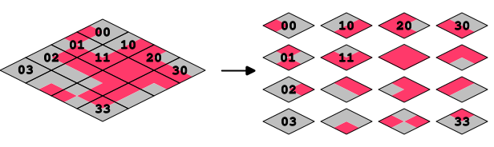

# TileCropper

TileCropper is a tool to manipulate your tileset, with the following options:  
1. Remove the margin and the separation between tiles of your tilesets.  
2. Reorder an isometric tileset to a general-purpose isometric tileset. See https://github.com/pablogila/TileMapDual_godot_node.  

The second option transforms a 16-tile isometric tileset as follows:  
  

## Usage

It just requires Python 3. Run in a terminal as:  
- Linux: `python3 TileCropper.py`  
- Windows: `python TileCropper.py`  

The user will be asked for further input.  

