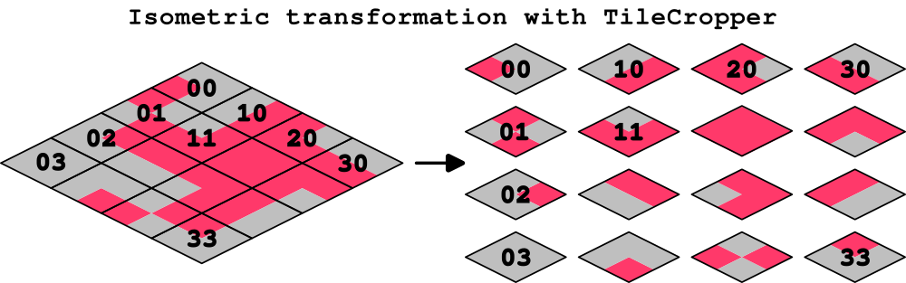
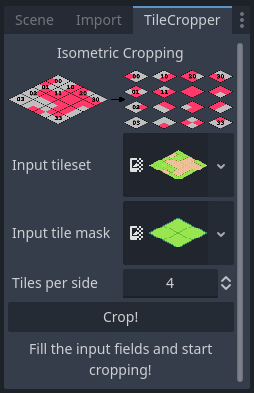

# TileCropper

It is way easier to draw isometric tiles grouped together. But most game engines require separating the tiles. This Godot plugin does it automatically for you!  

## Installation and usage

TileCropper is installed as a regular Godot plugin.
Just copy the `addons/TileCropper` folder to your Godot project, and enable it on *Project*, *Project settings...*, *Plugins*.  

A new **TileCropper** dock will appear on the upper-left corner, next to the *Scene* and *Import* docks:  

You can now drag here your input tileset, and a single tile to be used as a cropping mask. You should also specify the number of tiles per side, which is 4 by default. Click the *Crop!* button, and you are done!  

Note that the size of the input images must match the size of the corresponding tileset and tile. In other words, do not use margins in these images. Check the `examples` folder for further reference.  

## Also check...

Although this plugin can be used independantly, it was created with the [TileMapDual](https://github.com/pablogila/TileMapDual) godot plugin in mind. TileMapDual provides a simple, real-time, in-editor and in-game dual-grid tileset system, that reduces the number of tiles required from 47 to just 15!

## License and contributing

This project is Open Source Software, released under the [MIT license](LICENSE). This basically means that you can do whatever you want with it. Enjoy!  

[This repo](https://https://github.com/pablogila/TileCropper/) is open to pull requests, just make sure to check the [contributing guidelines](CONTRIBUTING.md).
I personally encourage you to send back any significant improvements to this code so that the Godot community continues to thrive. Thanks! 

This project has contributions from:
- Pablo Gila (@gilapixel)
- u/pideon_pete
